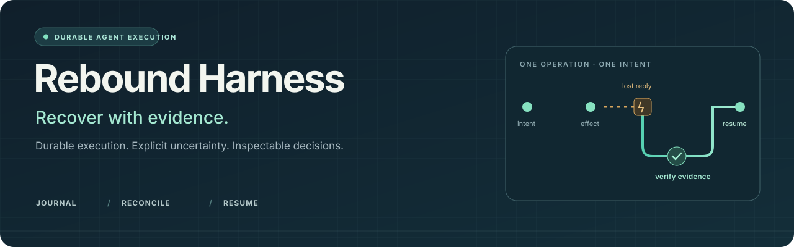
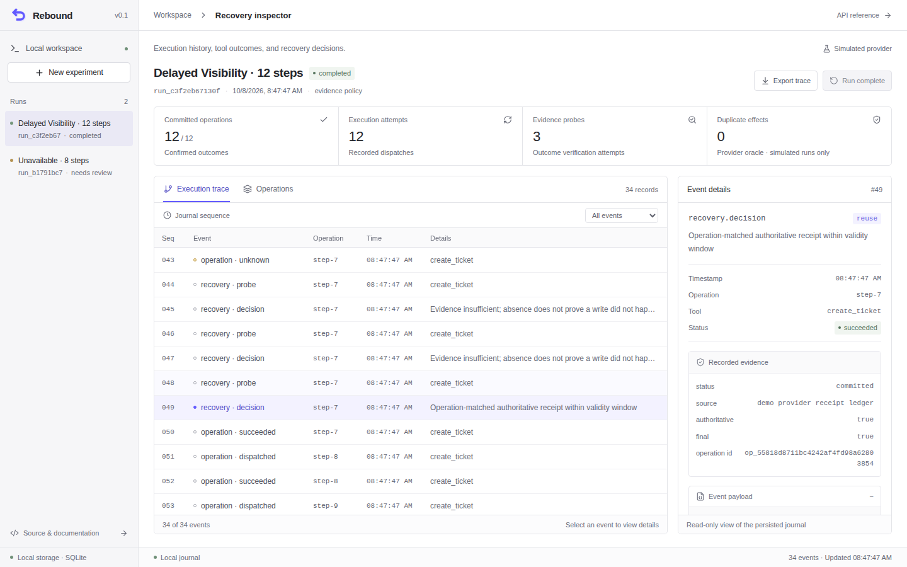
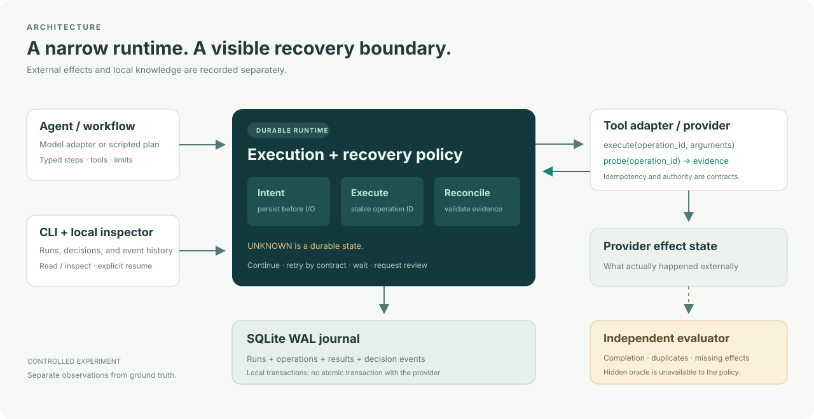
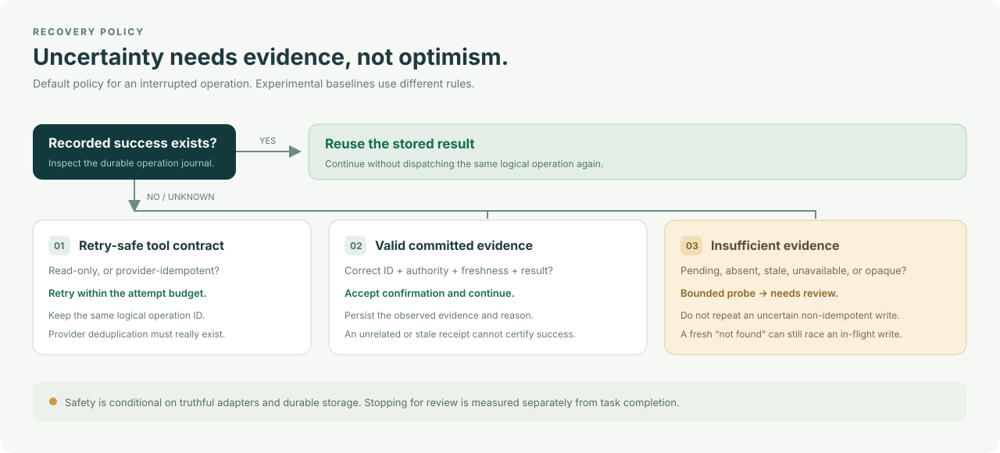
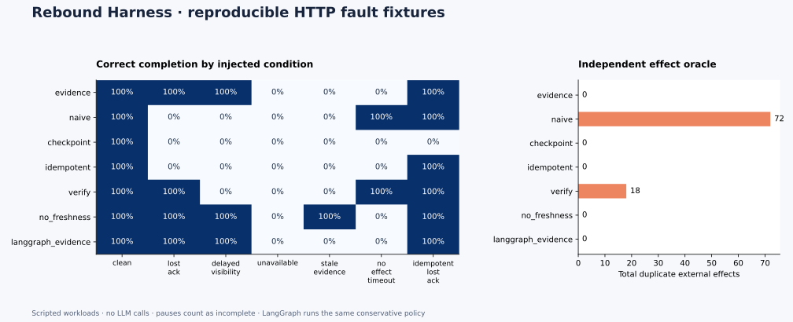

<p align="center">
  
</p>

<p align="center"><strong>面向长任务可靠执行与恢复评测的 Agent Harness。</strong></p>
<p align="center"><a href="README.md">English</a> · <a href="docs/recovery-contract.md">恢复契约</a> · <a href="docs/experiments.md">实验协议</a> · <a href="docs/related-work.md">相关工作</a></p>

## 解决什么问题

Agent 创建了一张工单，服务端已经成功写入，但返回结果在网络中丢失。进程重启后，应该再创建一次，还是直接继续？

检查点能够说明本地保存了什么，无法单独证明外部操作是否发生。盲目重试可能产生重复工单；直接跳过可能遗漏工作。

**Rebound 将“结果未知”作为显式状态保存，并根据工具契约和可核验的证据决定如何恢复。** 每个逻辑操作拥有稳定的 ID，执行前持久化意图，恢复决策记录依据；独立的效果记录用于检查最终结果。

项目包含 Python 运行时、SQLite 持久化、故障注入评测、CLI 和本地 Web 检查界面。它是单机研究与工程原型，适合研究恢复语义、验证工具适配器和构建可检查的本地 Agent；不提供无条件的全局 exactly-once 保证。

## 快速运行

需要 Python 3.12+。演示和脚本化评测不需要模型 API Key。

```bash
git clone https://github.com/Ailta666508/rebound-harness.git
cd rebound-harness
python3 -m venv .venv
source .venv/bin/activate
pip install -e '.[dev,benchmark]'

rebound demo --scenario lost_ack --policy evidence --steps 8 --data .rebound
rebound runs --data .rebound
```

从源码安装时，Web 界面需先构建一次（Node.js 24、pnpm 11.25.0）；发布版 wheel 包含已构建的界面，CLI 本身不依赖 Node.js。

```bash
cd frontend
pnpm install --frozen-lockfile
pnpm build
cd ..
rebound serve --data .rebound --port 8787
```

访问 [localhost:8787](http://localhost:8787) 查看任务、操作和恢复事件。演示中的外部服务是模拟服务，效果状态存放在独立数据库中。

使用命令输出中的任务 ID：

```bash
rebound inspect RUN_ID --data .rebound
rebound verify RUN_ID --data .rebound
rebound resume RUN_ID --data .rebound
```

`inspect` 读取记录，`verify` 检查记录；`resume` 会继续实际执行，并可能调用工具。离线检查不会重新触发写操作。

## 看清每一次恢复决策



这是端到端浏览器测试生成的实际截图。模拟服务的前两次查询看不到已经提交的操作，第三次返回回执；界面展示持久化日志中的真实状态。[手机端截图](docs/assets/inspector-mobile.png) · [浏览器测试](frontend/e2e/smoke.mjs)。

## 如何恢复



| 工具类型 | 操作结果未知时的处理 |
| --- | --- |
| `read_only`：只读 | 在预算内重试 |
| `idempotent`：提供方保证幂等 | 沿用原操作 ID 重试，依赖提供方去重 |
| `reconcilable`：可查询核验 | 接受有效的成功证据；否则等待、继续探测，预算耗尽后进入人工复核 |
| `opaque`：无法核验 | 停止自动恢复，请求人工复核 |

**“查不到”不等于“没有发生”。** 查询可能存在延迟，原请求也可能仍在运行。因此，默认策略不会仅凭查询返回不存在，就再次执行结果未知的非幂等写操作。



证据校验关注操作 ID、来源是否有权确认结果、有效时间，以及是否包含可用结果。策略无法弥补虚假的工具声明或不可靠的上游语义，详见[恢复契约](docs/recovery-contract.md)。

## 评测什么

```bash
rebound benchmark --output benchmarks/results --seeds 5
```

评测覆盖丢失回执、延迟可见、探测不可用和陈旧证据，并比较基础重试、持久化检查点、提供方幂等重试、重试前核验、完整证据策略和移除时效校验的消融版本。真实 LangGraph 适配器在持久化 `StateGraph` 上实现相同的保守策略，作为策略可移植性的对照，预期结果一致，不用于宣称击败 LangGraph。

每个策略面对相同的工具能力和故障日程。策略只看到工具返回信息，评测器单独读取真实效果记录，检查完成率、重复效果、遗漏效果、人工复核率和探测成本。结果与原始记录见 [benchmarks](benchmarks/)，解释方式见[实验协议](docs/experiments.md)。

参考矩阵使用 2 个种子以及 4、16、32 个外部操作；CLI 默认长度为 4、12、24。评测提供方通过独立进程中的本地 HTTP 服务执行受控任务。陈旧回执场景检验时效规则及其完成率成本，不证明时效校验一定改善外部效果安全。

这些实验检验运行时的恢复机制，不代表真实模型的推理能力，也不应外推为生产环境可用性指标。

### 已测得的参考结果

仓库保存了 **882 次脚本化实验、756 次实际触发的故障**，每种策略 126 次：3 类任务 × 7 种条件 × 3 个长度 × 2 个种子。实验调用真实的本地 HTTP 服务，但任务是受控夹具，**没有调用 LLM**，不代表生产环境可靠性。

| 策略 | 正确完成率 | 待人工复核 | 重复效果数 | 接受过期回执数 |
| --- | ---: | ---: | ---: | ---: |
| Rebound `evidence` | 57.1% | 42.9% | 0 | 0 |
| `langgraph_evidence` | 57.1% | 42.9% | 0 | 0 |
| `naive` | 42.9% | 0.0% | 72 | 0 |
| `no_freshness` | 71.4% | 28.6% | 0 | 18 |

正确完成要求独立评测器确认每个预期效果恰好出现一次。基础重试策略虽然报告 **100% 已完成**，实际仅 42.9% 通过检查。Rebound 与采用同一策略的 LangGraph 结果一致；进入人工复核仍计为任务未完成。

移除时效检查后，策略接受了 18 份过期回执，完成率提高。这些场景中的真实效果仍然存在，因此结果体现的是**时效规则遵循与自动完成率的取舍，不能据此证明时效检查提升了外部结果正确性**。完整七种策略结果、原始记录与复现配置见[报告](benchmarks/reference/report.md)、[实验记录](benchmarks/reference/results.jsonl)和[配置及来源](benchmarks/reference/summary.json)。



## 自己的设计与已有工作

项目聚焦三个可验证的设计点：证据有效性契约、观察质量受控的恢复实验、可离线检查的恢复记录。检查点、幂等键、故障注入和工具账本都有已有工作，不作为独创概念。

研究假设是：在相同工具能力和核验预算下，显式检查证据的身份、权威性与时效，能够改善恢复的安全性与完成率之间的取舍。仓库中的实验用于验证这个具体假设。

设计参考 Pi、OpenHands、LangGraph、Deep Agents、Temporal、Pydantic AI、mini-swe-agent 与 Agent Foundation；直接相关的研究工程项目包括 UndoBench、Agent Reliability Lab、CONTINUUM 和 AgentLedger。完整来源、区别与局限见[相关工作](docs/related-work.md)。

## 技术栈与源码阅读

| 层 | 技术与职责 |
| --- | --- |
| 核心运行时 | Python 3.12+、asyncio、Pydantic；执行状态机与恢复规则 |
| 持久化 | SQLite WAL；操作状态与事件的事务化保存 |
| 接口 | Typer / Rich CLI，FastAPI 本地 API |
| 界面 | React、TypeScript、Vite |
| 测试 | pytest、属性测试、故障场景与适配器检查 |

建议按 `models → store → runtime → demo → benchmark → api` 阅读。文档包括[架构](docs/architecture.md)、[局限与路线图](docs/limitations.md)、[可选 MCP 工具适配](docs/mcp.md)和[项目讲解提纲](docs/interview-guide.md)。

## 可运行示例

```bash
python examples/durable_workflow.py
python examples/typed_agent.py
```

第一个示例提供显式的进程中断与恢复参数；第二个默认使用离线模型夹具，演示工具调用与 Pydantic 类型化最终输出，无需密钥。

## 连接模型

```bash
export REBOUND_API_KEY='your-provider-key'
rebound agent 'Write a short note explaining safe retries' \
  --model YOUR_MODEL \
  --base-url https://YOUR_PROVIDER/v1
```

工具计划与最终回答会持久化；Python 接口的 `output_model` 可以校验最终 JSON。上下文裁剪保留完整的 assistant/tool 消息组；最新消息组超出预算时进入复核状态。接口需要支持兼容的 chat/tool-call 格式。API Key 从环境变量读取，请勿写入提交文件。参数与执行限制可通过 `rebound agent --help` 查看。

## 作者与许可

作者：[Ailta666508](https://github.com/Ailta666508)。Apache-2.0 许可；参考项目保留来源说明，前端依赖保留[第三方许可证](THIRD_PARTY_NOTICES.md)。
